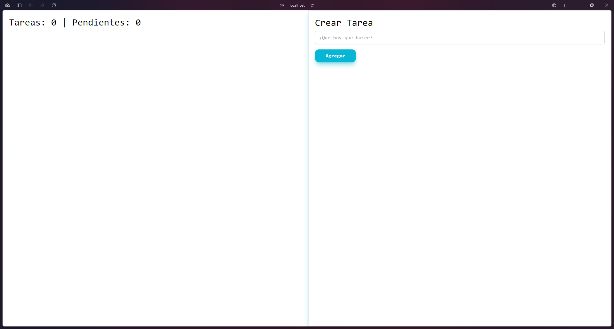
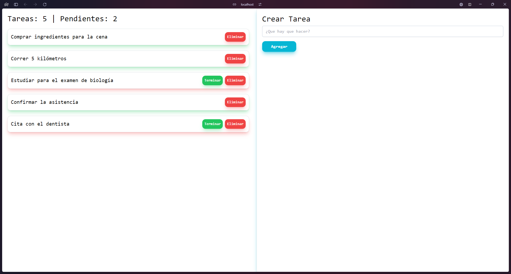
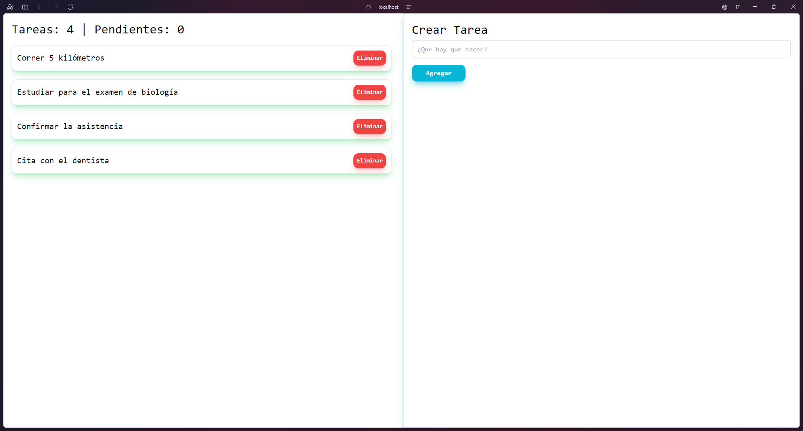
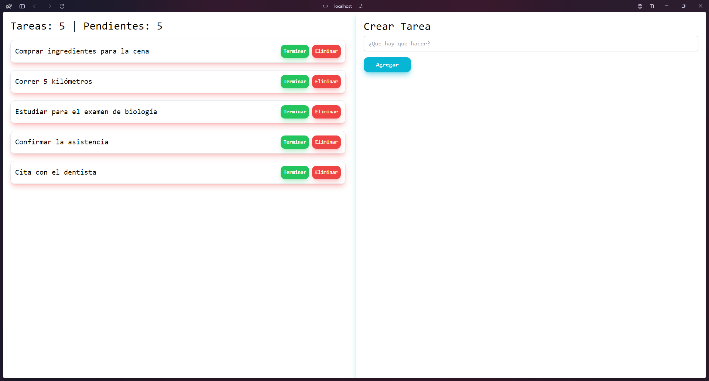

# React TodoList

Lista de tareas en React JS 18.2.0 || Tailwind CSS, guardado en el localStorage

## Instalación

Instalar Dependencias

Run
```bash
yarn
```
## Iniciar Proyecto
Run
```bash
yarn dev
```

## Preview



